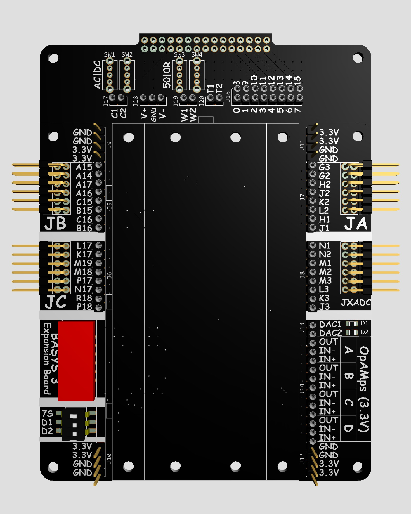
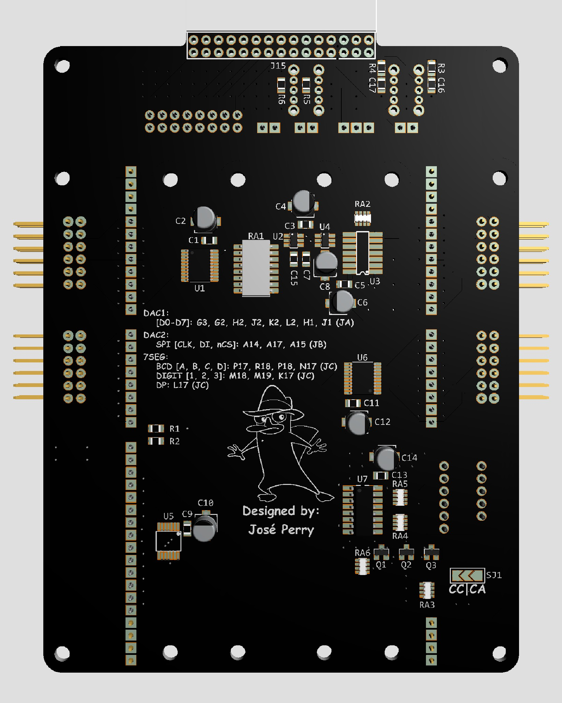

# BASYS3 Expansion Board

A custom expansion board for the Digilent BASYS3 FPGA Development Board, designed to provide additional peripherals for FPGA development, prototyping, and experimentation.

> **Status:** Hardware design completed. Awaiting PCB fabrication and assembly.

---

## Overview

This project extends the capabilities of the BASYS3 FPGA board by integrating commonly used peripherals onto a single expansion board. It was developed as a personal hardware project to provide a convenient platform for future projects.

---

## Preview

  
  

---

## Specifications

| Item                  | Description                                         |
| --------------------- | --------------------------------------------------- |
| Target Platform       | Digilent BASYS3 FPGA Development Board              |
| PCB Layers            | 2                                                   |
| PCB Thickness         | 1.6 mm FR-4                                         |
| Copper Weight         | 1 oz                                                |
| Logic Level           | 3.3 V CMOS                                          |
| Power Source          | BASYS3 expansion connectors (JA & JXADC or JB & JC) |
| DACs                  | 8-bit DAC and 12-bit DAC                            |
| Seven-Segment Display | 3 digits with BCD decoder and digit multiplexing    |
| Expansion Headers     | Standard 2.54 mm pitch                              |
| Prototyping Area      | 470 points solderless breadboard                    |
| Debug Interface       | Analog Discovery compatible header                  |
| PCB Dimensions        | 3.8in x 5.12in (97mm x 130mm)                       |

---

## Documentation

* Schematic (PDF)
* PCB top and bottom views
* PCB renders
* Assembled board pictures *(to be added after fabrication)*
* Bill of Materials *(TODO)*

*NOTE*: This repository is intended as a portfolio showcase of the project, so CAD project files and Gerber files are intentionally **not** included.

---

## Design Goals

* Extend the BASYS3 with additional hardware resources.
* Maintain a simple, easy-to-understand design.
* Use off-the-shelf components.

---

## Future Work

* Manufacture and assemble the PCB
* Hardware validation and testing
* Add photographs of the assembled board
* Publish example FPGA projects demonstrating the peripherals

---

## License

The documentation and images contained in this repository are licensed under the MIT License unless otherwise stated.

The hardware design itself is **not** open source. This repository does not include the native CAD project files or manufacturing data required to reproduce the board.
