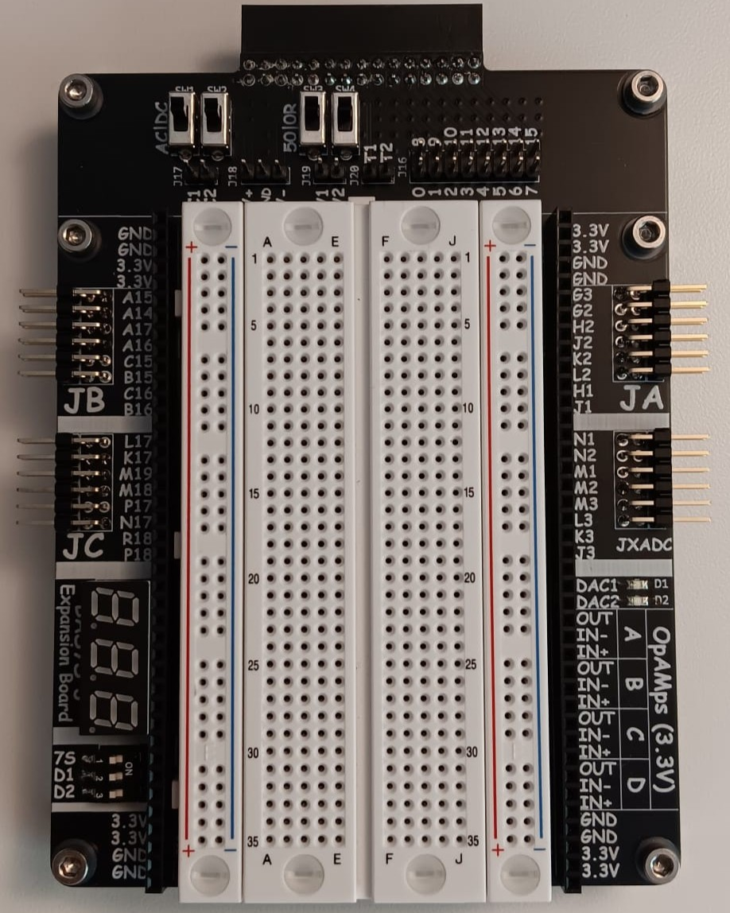
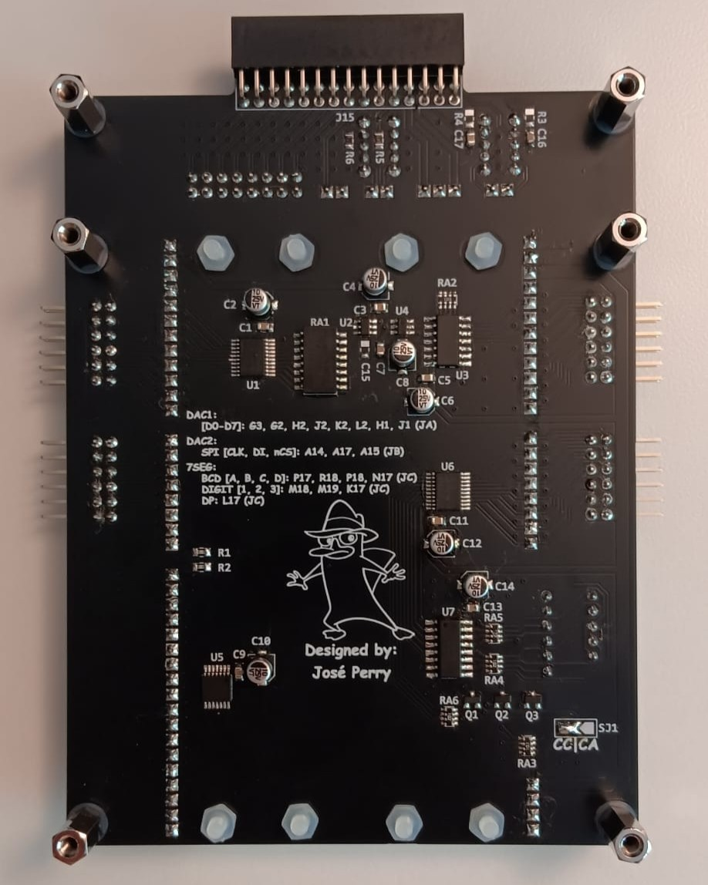

# BASYS3 Expansion Board

> **Status:** PCB Assembled. Finalizing documentation and performing HW testing.

## Overview

The BASYS3 already provides plenty of digital I/O, switches, LEDs, and displays, but it lacks analog output and signal conditioning capabilities. This board was created to fill that gap by adding a pair of DACs, a quad op amp, Analog Discovery 2 connectivity, and a prototyping area on a single expansion board.

The design goals were to extend the BASYS3 with additional hardware resources while keeping the design simple, easy to understand, and based on readily available off-the-shelf components.

The result is a compact platform for experimenting with digital-to-analog conversion, basic analog circuits, and mixed-signal FPGA projects.

  
  

## Specifications

| Item                      | Description                                          |
| ------------------------- | ---------------------------------------------------- |
| **Target Platform**       | BASYS3 FPGA Development Board                        |
| **PCB Specs**             | 2 Layer, 1.6 mm FR-4, 1 oz, 3.8in x 5.12in, LeadFree HASL, Manufactureer: JLCPCB |
| **Power Source**          | 3.3 V from BASYS3 Pmod ports (JA & JXADC or JB & JC) |
| **Logic Level**           | 3.3 V CMOS                                           |
| **DACs**                  | 8-bit R-2R and 12-bit SPI                            |
| **7-Segment Display**     | 3 digits with BCD decoder, digit multiplexing and CC/CA selection |
| **OpAmps**                | Quad Opamp (MCP6004 or MCP6499)                      |
| **Expansion Headers**     | Standard 2.54 mm pitch                               |
| **Prototyping Area**      | 470 points solderless breadboard                     |
| **Debug Interface**       | Analog Discovery connection                          |

## Peripherals Pinout

| Parameter | DAC1 | DAC2 | 7-Segment Display |
|------------|------|------|-------------------|
| **Type** | Discrete R-2R | Integrated (DAC121S101) | 3-Digit, CC/CA Selectable |
| **Interface** | 8-bit Parallel | SPI (Simplex) | 4-bit BCD + Digit Select |
| **Inputs** | D0: G3 D1: G2 D2: H2 D3: J2 D4: K2 D5: L2 D6: H1 D7: J1 | CLK: A14 DI: A17 nCS: A15 | BCD_A: P17 BCD_B: R18 BCD_C: P18 BCD_D: N17 D1: M18 D2: M19 D3: K17 DP: L17 |
| **Pmod Connector** | JA | JB | JC |
| **Outputs** | DAC1 (J13) | DAC2 (J13) | Display (LD1) |
| **Enable** | DSW1 (D1) | DSW1 (D2) | DSW1 (7S) |
| **Power-on Indicator** | LED D1 | LED D2 | N/A |

> [!TIP]
> The pin labels are also marked on the bottom side of the PCB.

## Documentation

* [Schematic](https://github.com/joseperry/Basys3-Expansion-Board/blob/main/CAD/schematic/BASYS3_Expansion_schematic.PDF)
* PCB top and bottom views ([Renders and photos](https://github.com/joseperry/Basys3-Expansion-Board/tree/main/CAD/images))
* [Bill of Materials *(TODO)*](https://github.com/joseperry/Basys3-Expansion-Board/#documentation)

> [!NOTE]
> This repository is intended as a portfolio showcase of the project, so CAD project files and Gerber files are intentionally **not** included.

## Future Work

* Hardware validation and testing
* Publish example FPGA projects demonstrating the peripherals

## License

The documentation and images contained in this repository are licensed under the MIT License unless otherwise stated.

The hardware design itself is **not** open source. This repository does not include the native CAD project files or manufacturing data required to reproduce the board.

---

	  

