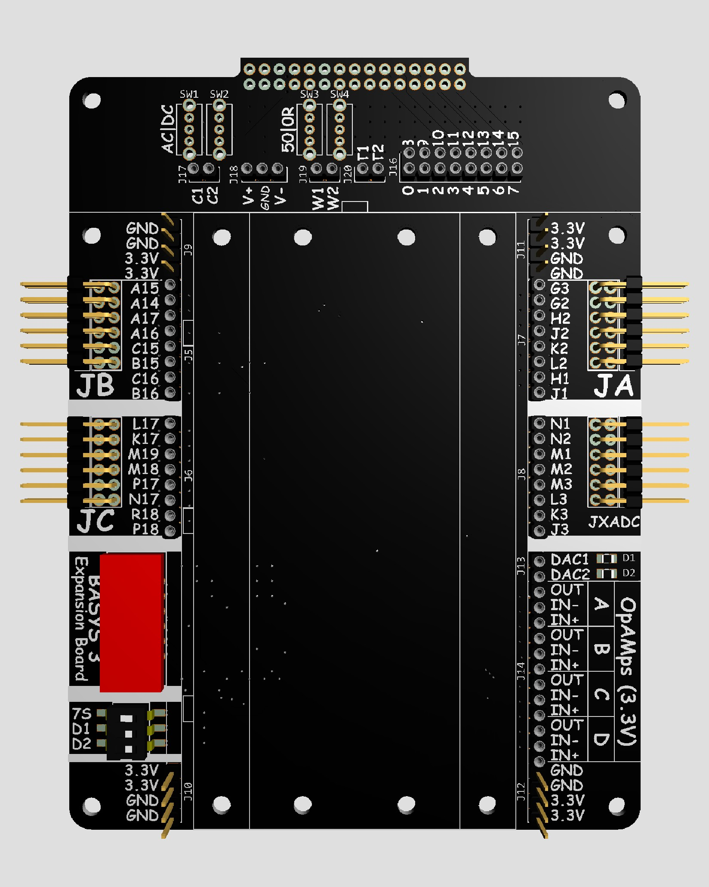
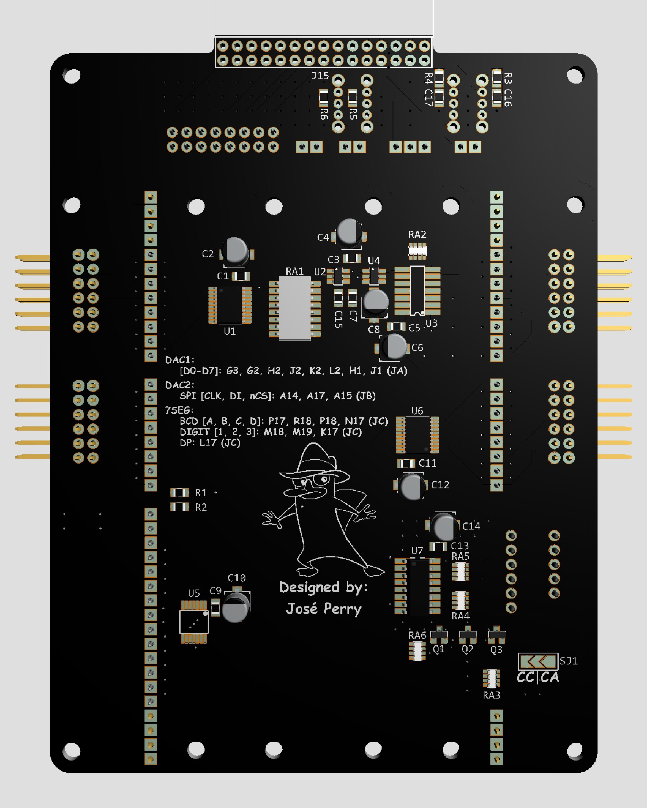
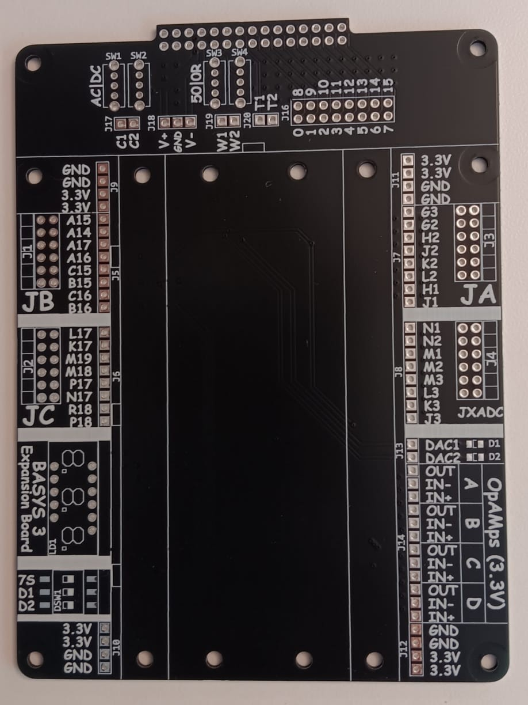
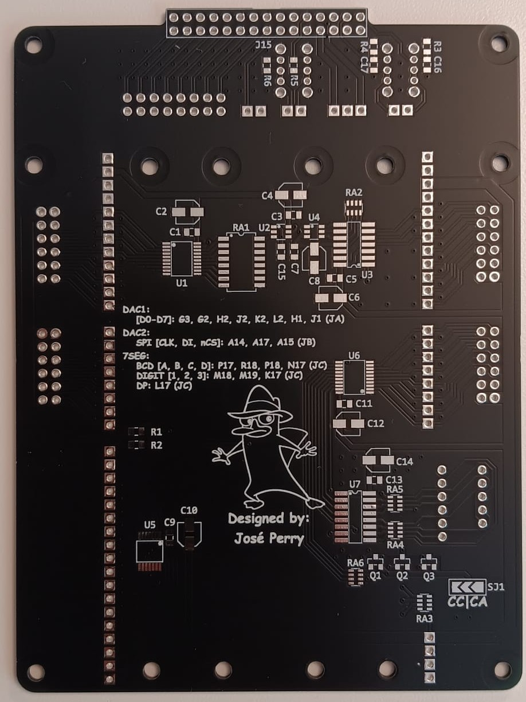

# BASYS3 Expansion Board

> **Status:** PCB fabrication completed. Awaiting for components and assembly.

---

## Overview

The BASYS3 already provides plenty of digital I/O, switches, LEDs, and displays, but it lacks analog output and signal conditioning capabilities. This board was created to fill that gap by adding a pair of DACs, a quad op amp, Analog Discovery 2 connectivity, and a prototyping area on a single expansion board.

The result is a compact platform for experimenting with digital-to-analog conversion, basic analog circuits, and mixed-signal FPGA projects.

---

## Preview

  
  

---

## Fabricated PCB

  
  

Might need to get better at taking pictures...

---

## Specifications

| Item                  | Description                                         |
| --------------------- | --------------------------------------------------- |
| Target Platform       | BASYS3 FPGA Development Board                       |
| PCB Layers            | 2                                                   |
| PCB Thickness         | 1.6 mm FR-4                                         |
| Copper Weight         | 1 oz                                                |
| Logic Level           | 3.3 V CMOS                                          |
| Power Source          | BASYS3 Pmod ports (JA & JXADC or JB & JC)           |
| DACs                  | 8-bit R-2R and 12-bit SPI |
| 7-Segment Display     | 3 digits with BCD decoder, digit multiplexing and CC/CA selection |
| OpAmps                | Quad Opamp (MCP6004)                |
| Expansion Headers     | Standard 2.54 mm pitch                              |
| Prototyping Area      | 470 points solderless breadboard                    |
| Debug Interface       | Analog Discovery connection |
| PCB Dimensions        | 3.8in x 5.12in (97mm x 130mm)                       |

---

## Peripherals Pinout

| Parameter | DAC1 | DAC2 | 7-Segment Display |
|------------|------|------|-------------------|
| **Type** | Discrete R-2R | Integrated (DAC121S101) | 3-Digit, CC/CA Selectable |
| **Interface** | 8-bit Parallel | SPI (Simplex) | 4-bit BCD + Digit Select |
| **Inputs** | D0: G3 D1: G2 D2: H2 D3: J2 D4: K2 D5: L2 D6: H1 D7: J1 | CLK: A14 DI: A17 nCS: A15 | BCD_A: P17 BCD_B: R18 BCD_C: P18 BCD_D: N17 D1: M18 D2: M19 D3: K17 DP: L17 |
| **Pmod Connector** | JA | JB | JC |
| **Outputs** | DAC1 (J13) | DAC2 (J13) | Display (LD1) |
| **Enable** | DSW1 (D1) | DSW1 (D2) | DSW1 (7S) |
| **Power-on Indicator** | LED D1 | LED D2 | N/A |

> [!TIP]
> The pin labels are also marked on the bottom side of the PCB.

---

## Documentation

* Schematic (PDF)
* PCB top and bottom views (3D and photos)
* PCB renders
* Assembled board pictures *(to be added)*
* Bill of Materials *(TODO)*

*NOTE*: This repository is intended as a portfolio showcase of the project, so CAD project files and Gerber files are intentionally **not** included.

---

## Design Goals

* Extend the BASYS3 with additional hardware resources.
* Maintain a simple, easy-to-understand design.
* Use off-the-shelf components.

---

## Future Work

* Manufacture and assemble the PCB
* Hardware validation and testing
* Add photographs of the assembled board
* Publish example FPGA projects demonstrating the peripherals

---

## License

The documentation and images contained in this repository are licensed under the MIT License unless otherwise stated.

The hardware design itself is **not** open source. This repository does not include the native CAD project files or manufacturing data required to reproduce the board.
